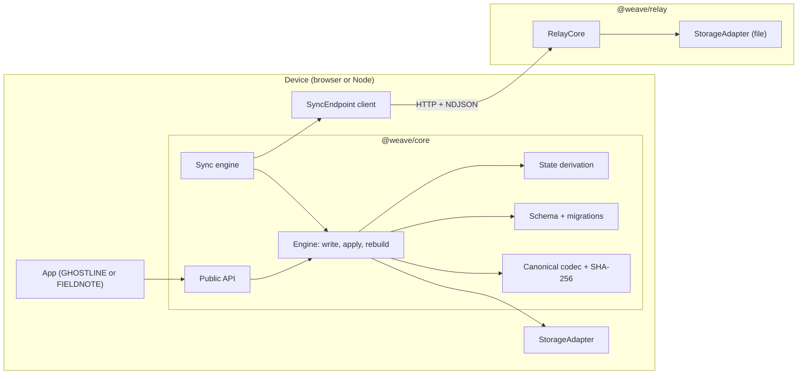

# Component diagram

```mermaid
flowchart LR
  subgraph Device["Device (browser or Node)"]
    APP["App (GHOSTLINE or FIELDNOTE)"]
    subgraph CORE["@weave/core"]
      API["Public API"]
      ENG["Engine: write, apply, rebuild"]
      DER["State derivation"]
      SCH["Schema + migrations"]
      CAN["Canonical codec + SHA-256"]
      SYN["Sync engine"]
    end
    STO["StorageAdapter"]
    TR["SyncEndpoint client"]
  end
  subgraph Relay["@weave/relay"]
    RC["RelayCore"]
    RS["StorageAdapter (file)"]
  end
  APP --> API --> ENG --> DER
  ENG --> SCH
  ENG --> CAN
  ENG --> STO
  SYN --> ENG
  SYN --> TR
  TR -- "HTTP + NDJSON" --> RC --> RS
```
