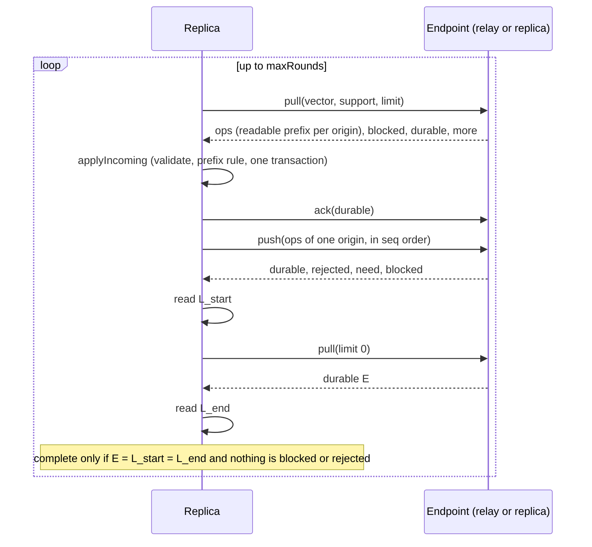

# Sync sequence

```mermaid
sequenceDiagram
  participant C as Replica
  participant R as Endpoint (relay or replica)
  loop up to maxRounds
    C->>R: pull(vector, support, limit)
    R-->>C: ops (readable prefix per origin), blocked, durable, more
    C->>C: applyIncoming (validate, prefix rule, one transaction)
    C->>R: ack(durable)
    C->>R: push(ops of one origin, in seq order)
    R-->>C: durable, rejected, need, blocked
    C->>C: read L_start
    C->>R: pull(limit 0)
    R-->>C: durable E
    C->>C: read L_end
    Note over C: complete only if E = L_start = L_end and nothing is blocked or rejected
  end
```
